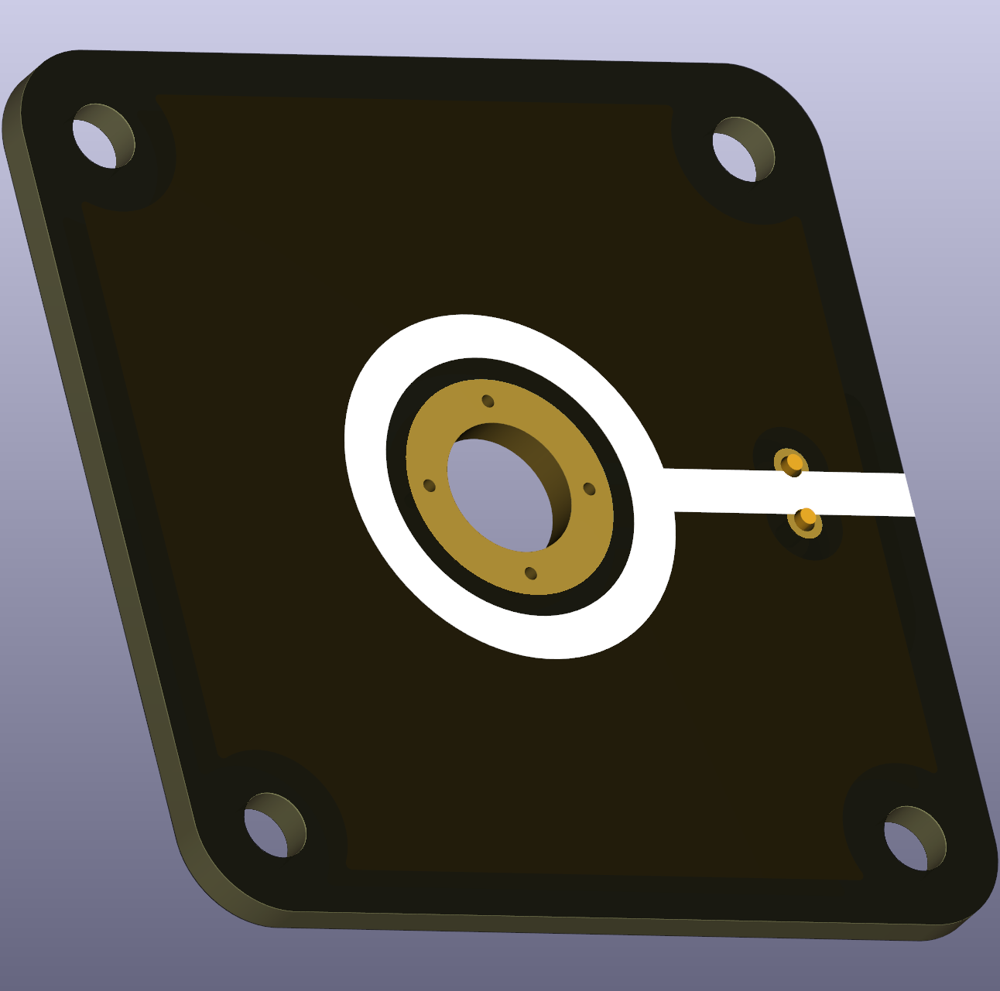

# Blank End Node

This puzzle piece is an unlabeled connector that can serve multiple functions in a circuit. It features an M6-sized hole where a banana plug terminal can be screwed in, allowing flexible use depending on your circuit's needs.

  
