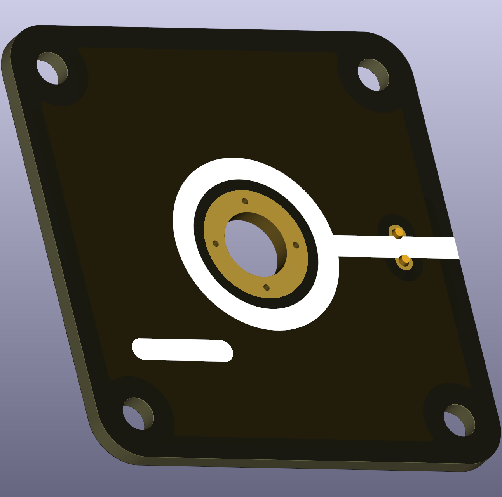

# Minus End Node

This puzzle piece is a labeled connector for the negative pole (ground/GND) of a power supply. It features an M6-sized hole where a black banana plug terminal is typically screwed in, following the standard convention that the minus pole is associated with ground and black indicates the negative connection.

  
