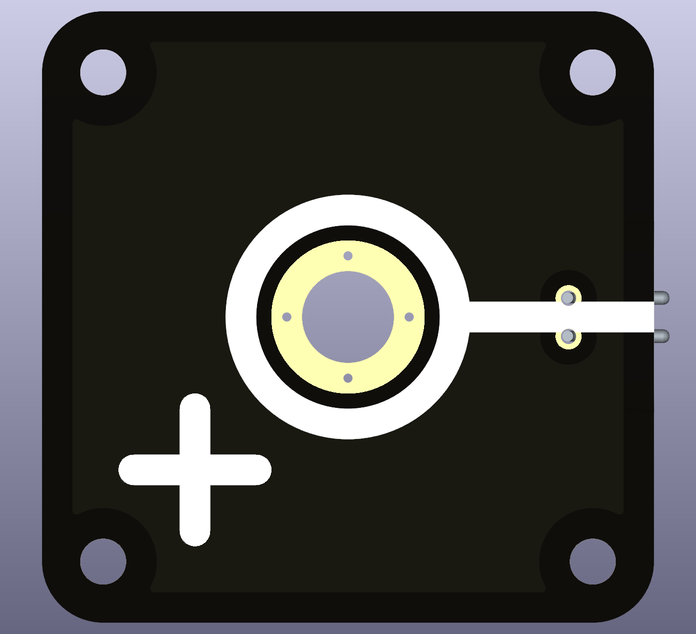
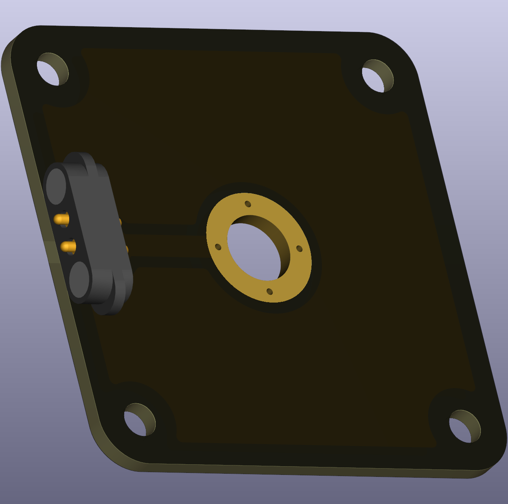

# Intro  
A plus labeled node that is used for plus pole or voltage supply. It comes with an M6-sized hole where a typical banana plug terminal can be screwed in. The plus pole is typically associated with supply voltage level, thus, it is recommended to screw in a red-colored terminal.

 
