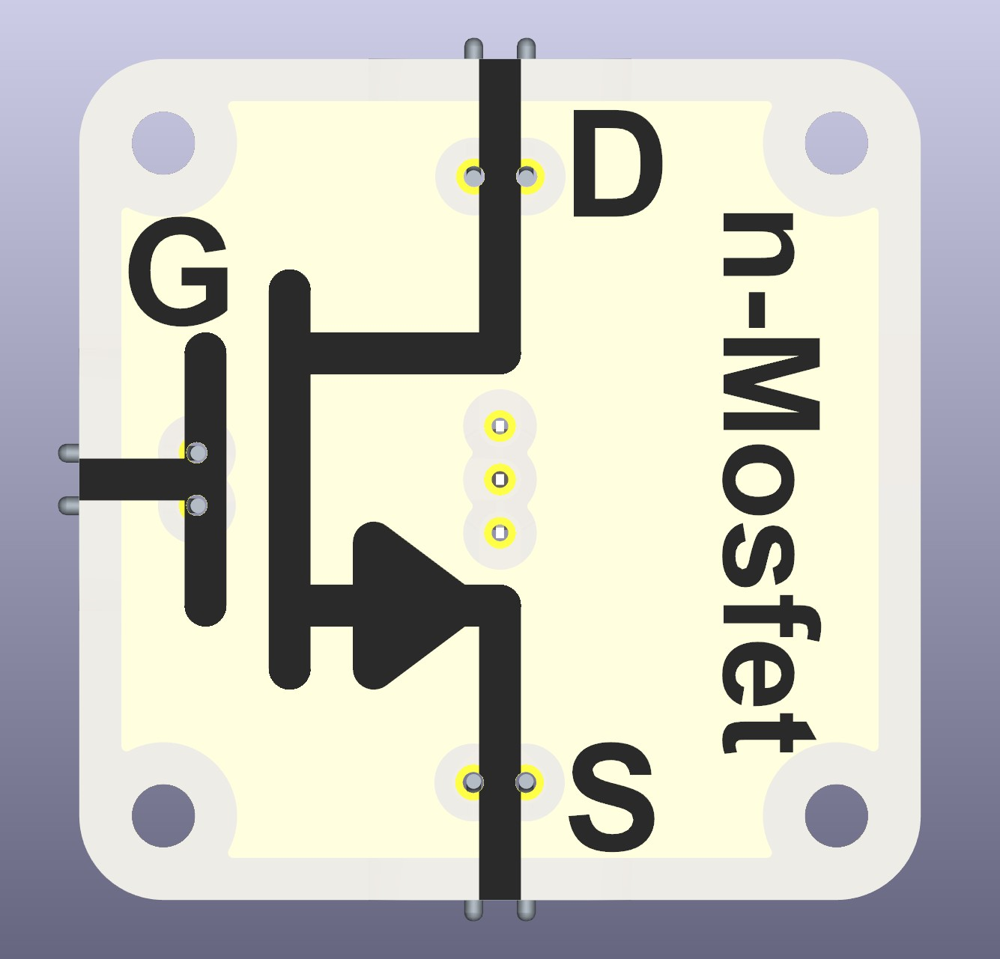
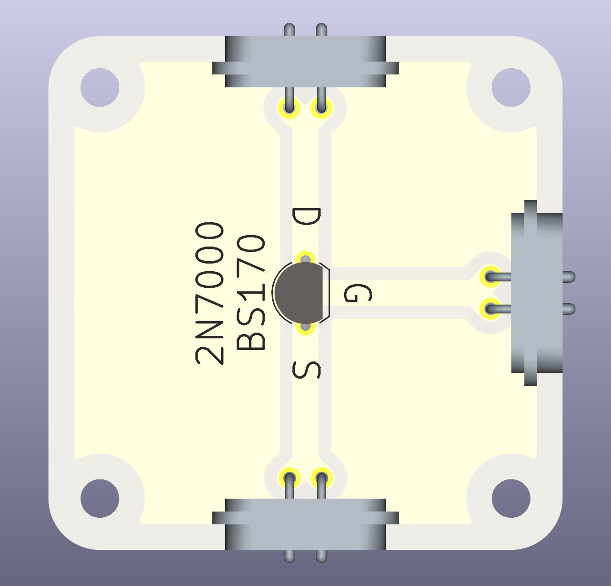

# Intro  
An **N-Channel MOSFET (Metal-Oxide-Semiconductor Field-Effect Transistor)** is an electronic component that works like a switch or amplifier. It controls the flow of electrical current in a circuit. Unlike mechanical switches, it has no moving parts and is controlled by a small voltage.
This ability **to control a large current with a small voltage** is what makes MOSFETs so useful in modern electronics. 

 

# For What It Is Used  
**mosfets are used in many electronic applications, such as:**  
* **Power control:** Switching power to motors, LEDs, or other components efficiently.  
* **Computers and microcontrollers:** Used inside processors and memory chips to switch signals extremely fast.  
* **Audio and signal amplification:** Boosting small signals in sound systems.  

## Advantages of an N-Channel mosfet  
* **Efficient:** Uses very little energy to switch large currents.  
* **Fast:** Can turn on and off millions of times per second.  
* **Durable:** No mechanical wear since it has no moving parts.  

# Functional Description  

A **mosfet works like a controlled valve for electricity**, and we can understand it using a **water analogy**.  

## The Three Terminals and Their Roles  

| **mosfet (Electricity)** | **Water Analogy (Hydrodynamics)** |
|--------------------------|----------------------------------|
| **Drain (D)** → Where current enters | **Water pipe inlet** → Where water flows in |
| **Source (S)** → Where current exits | **Water pipe outlet** → Where water flows out |
| **Gate (G)** → Controls the flow | **Valve handle** → Opens or closes the pipe |

## How It Works  
- **Gate OFF (No voltage applied, GND)** → The mosfet acts like a closed valve, blocking current. No water (electricity) can flow.  
- **Gate ON (Voltage applied, Von)** → The mosfet acts like an open valve, allowing current to flow from Drain to Source, just like water moving through an open pipe.  

# MOSFET vs. NPN BJT  

While an **N-Channel MOSFET** and an **NPN Bipolar Junction Transistor (BJT)** can both be used as switches, they operate differently:  

| **Feature**            | **N-Channel MOSFET** | **NPN BJT** |
|------------------------|---------------------|------------|
| **Control Signal**      | Voltage (Gate-Source) | Current (Base-Emitter) |
| **Efficiency**         | Higher, almost no power wasted at Gate | Lower, Base consumes current |
| **On-State Resistance, Heat** | Very low resistance (milliohms) and heat generation | higher resistance (ohms) and heat generation |
| **Response Behavior**  | More binary: mostly ON or OFF | Linear: smooth amplification possible even at low voltages |
| **Best For**           | High-power switching, efficiency-critical applications | Low-power analog amplification, simpler circuits |

### **Key Differences:**
- **MOSFETs act more like digital switches** → either fully ON or fully OFF, making them great for power electronics and digital circuits.  
- **BJTs provide a smooth, continuous response** → useful for amplifiers where you need to control the signal strength precisely.  

# Compatible and Recommended Part(s)  
Any logic-level MOSFET with long and flexible enough legs for the three terminals can be used, in theory. The TO-92 housing with wide legs is preferred. Also check the pinout of legs, not all follow the pinout of D-G-S. Some do not place the gate in the middle position.  

The recommended parts—cheap, reliable, and widely available—are:  
- **2N7000**  
- **BS170**  
