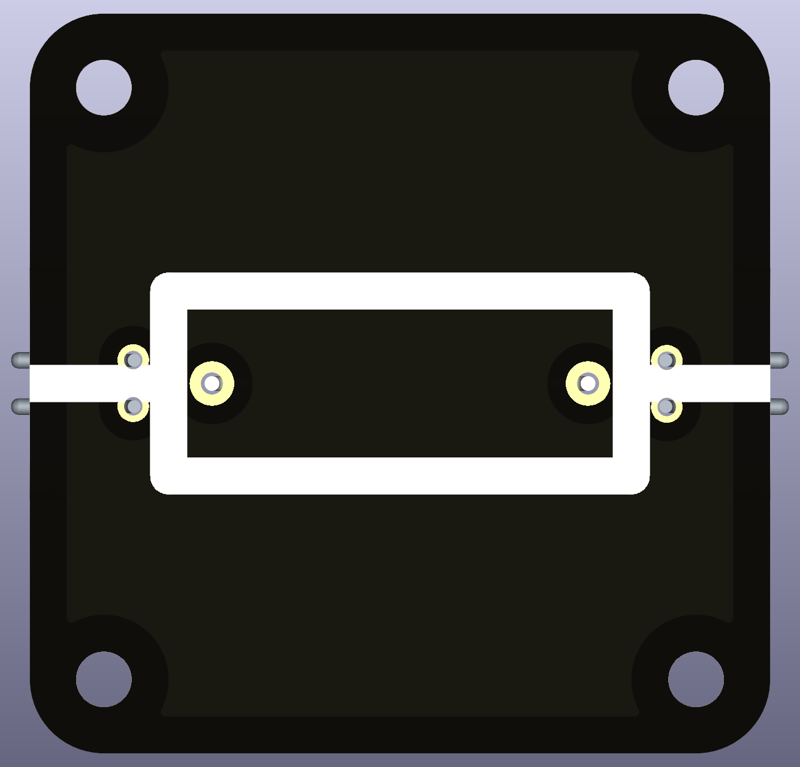
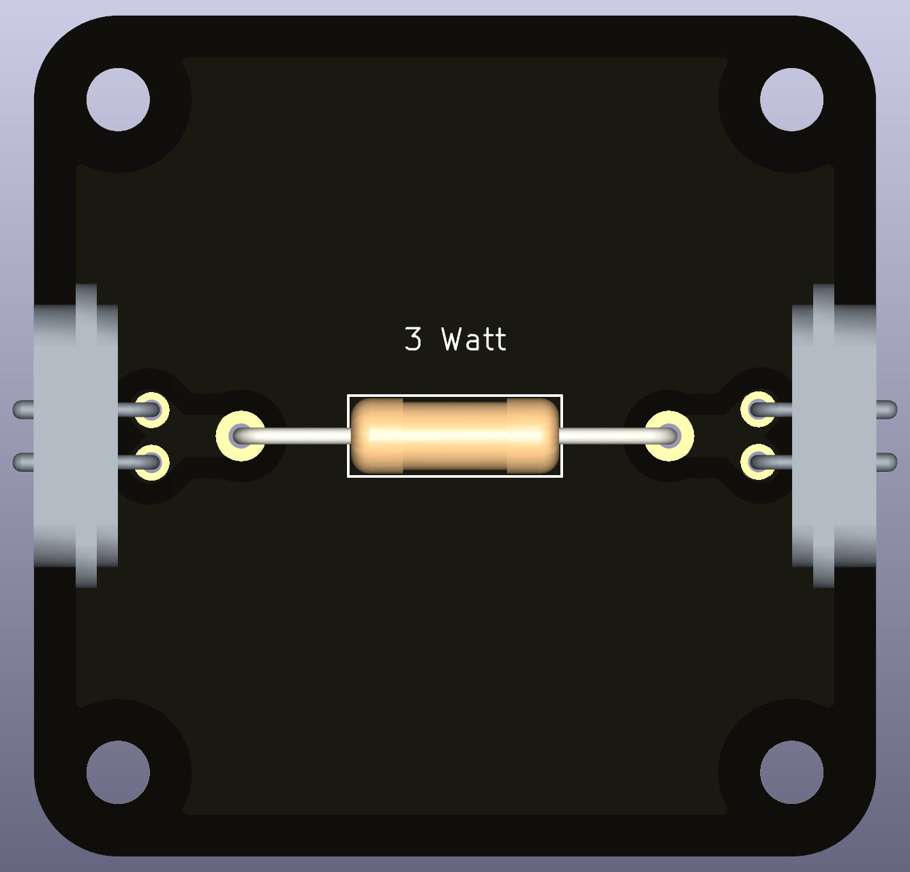

# Intro  
A **resistor** is one of the most fundamental electronic components. It **limits the flow of electric current** and is used to control voltage and current in a circuit.  
Resistors follow **Ohm's Law (V = I × R)**, meaning the voltage drop across the resistor is proportional to the current flowing through it.  

 

---

# For What It Is Used  
**Resistors are commonly used in:**  
- **Current limiting:** Preventing excessive current in LEDs and other components.  
- **Voltage division:** Creating reference voltages by dividing a supply voltage.  
- **Signal conditioning:** Adjusting or filtering signals in electronic circuits.  
- **Heat generation:** Converting electrical energy into heat in applications like heaters and braking systems.  

## Advantages of Resistors  
✅ **Simple & Reliable:** No moving parts, extremely durable.  
✅ **Precise Control:** Allows exact control of current and voltage.  
✅ **Wide Range of Values:** Available in various resistance values (Ω to MΩ).  

---

# Functional Description  

A **resistor behaves like a narrow pipe that restricts water flow** in a plumbing system.  

## The Two Terminals and Their Roles  

| **Resistor (Electricity)** | **Water Analogy (Hydrodynamics)** |
|---------------------------|----------------------------------|
| **Voltage (V)** → The "pressure" across the resistor | **Water pressure difference** between two sides of the restriction |
| **Current (I)** → The flow of charge through the resistor | **Flow rate of water** through the pipe |
| **Resistance (R)** → The opposition to current flow | **Narrowing of the pipe**, making it harder for water to flow |

## How It Works  
- **Higher resistance (R ↑)** → Less current flows (like a narrow pipe restricting water).  
- **Lower resistance (R ↓)** → More current flows (like a wider pipe allowing more water through).  
- **No resistance (R = 0 Ω, short circuit)** → Current flows freely (like a fully open pipe).  

Ohm’s Law governs this relationship:  
V = I × R
where:  
- V: Voltage (Volts)  
- I: Current (Amperes)  
- R: Resistance (Ohms, Ω)  

---

# Important Considerations  

⚠️ **Power Rating Matters!** A resistor dissipates power as heat:  
P = V × I = I^2 × R = V^2 / R
If the power rating is exceeded, the resistor **may overheat and burn out**.  

⚠️ **Tolerance:** Real resistors are not perfect; they have a tolerance (e.g., ±5%) indicating variation from their labeled value.  

⚠️ **Temperature Coefficient:** Some resistors change resistance slightly with temperature.  

---

# Common Types of Resistors  

| **Type** | **Description** | **Use Cases** |
|----------|---------------|---------------|
| **Carbon Film** | Common, cheap, ±5% tolerance | General-purpose circuits |
| **Metal Film** | Low noise, ±1% tolerance | Precision applications |
| **Wire Wound** | High power handling | Heaters, power electronics |
| **Variable Resistor (Potentiometer)** | Adjustable resistance | Volume controls, sensors |

---

# Compatible and Recommended Part(s)  
Any THT resistor will work. I recommend to use ones with lower tolerances, 1%, and high wattage/heat dissipation, 3W. Those resistors are usually bulky and survive very long.
For school settings and various experiments, you want to have a broad range of resistances. 300Ω is a reasonable resistance for LEDs at lower voltages. 1MΩ is a reasonable resistance when charging a capacitor and make it visible on slow time scales.
