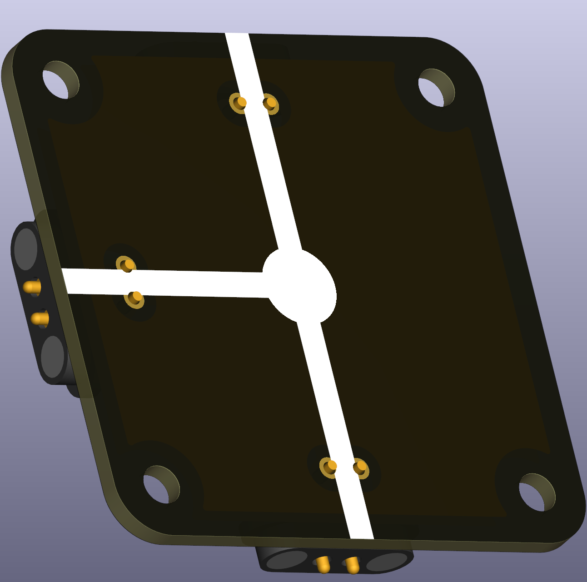

# Wire T-Crossing

This puzzle piece is a T-shaped wire junction that allows connections in three directions: along one line and perpendicular to it. Use it whenever your circuit has a branch that splits off from a main wire run.

 
