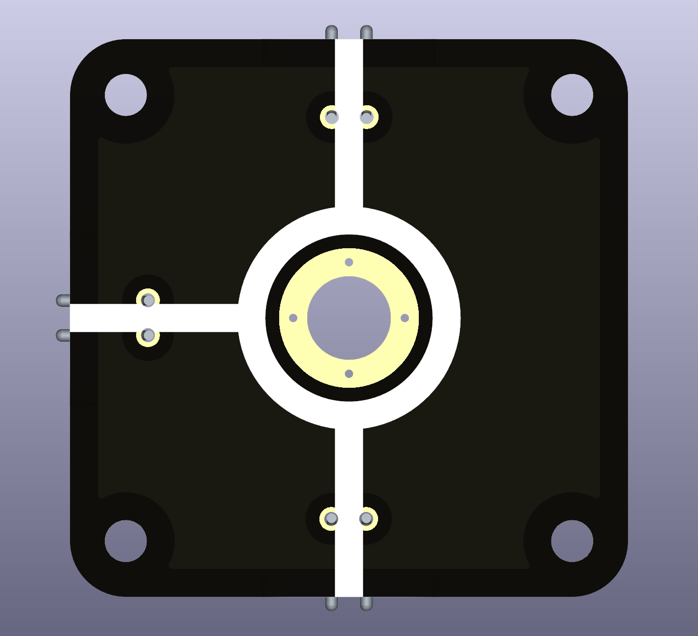
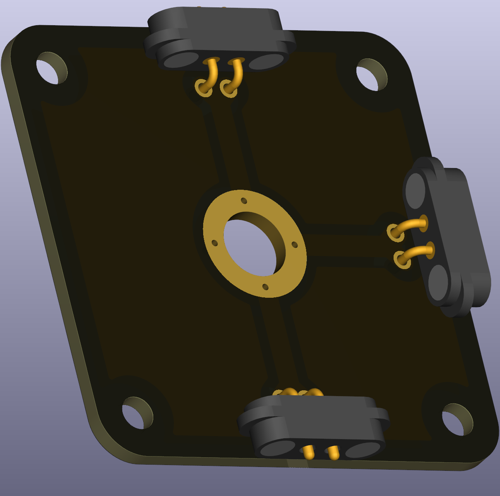

# Wire T-Crossing with Voltage Node

This puzzle piece is a T-shaped wire junction that allows connections in three directions (one along a line, one perpendicular) plus an M6-sized hole for a banana plug connector to measure voltage at that node. It's perfect when you need to branch off one connection while measuring the voltage at that branch point.

  