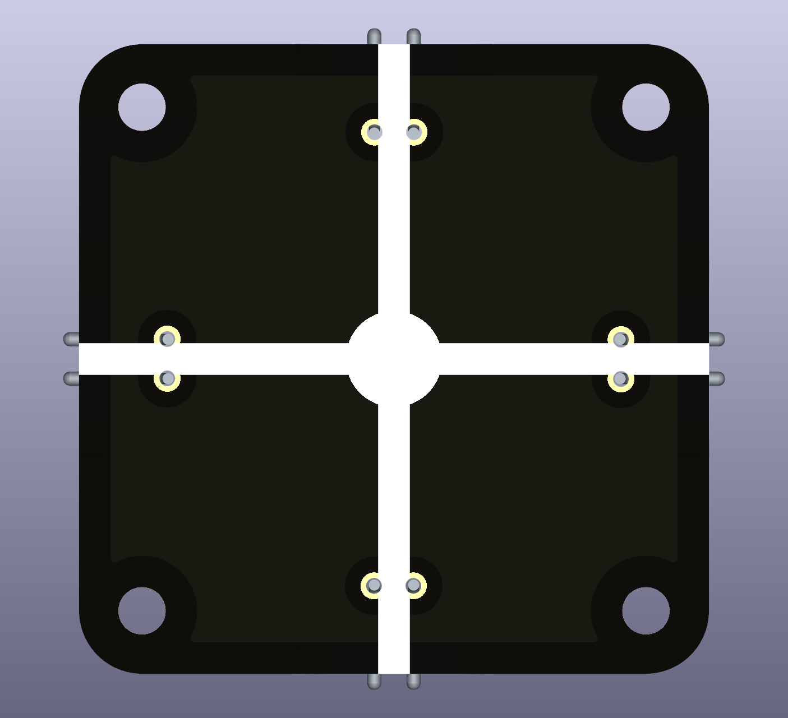
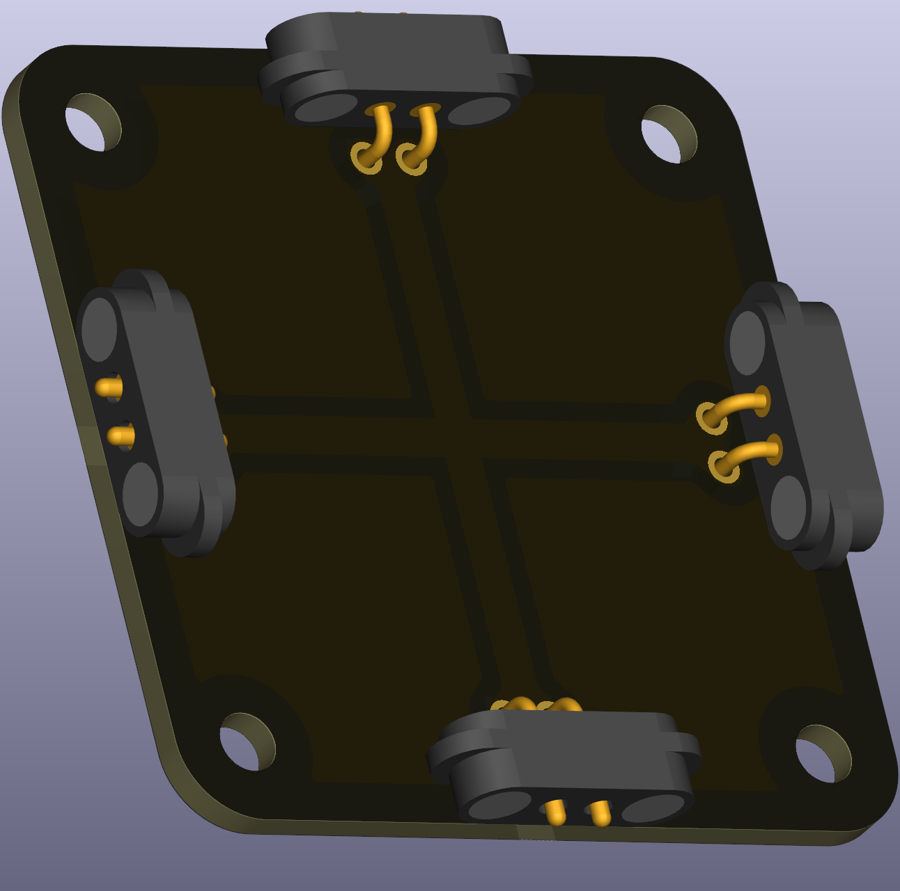

# Wire X-Crossing

This puzzle piece is a wire junction that allows connections in four directions (two horizontal, two vertical). Use it whenever your circuit layout requires wires to cross each other or when you need a central connection point for four separate branches.

 
