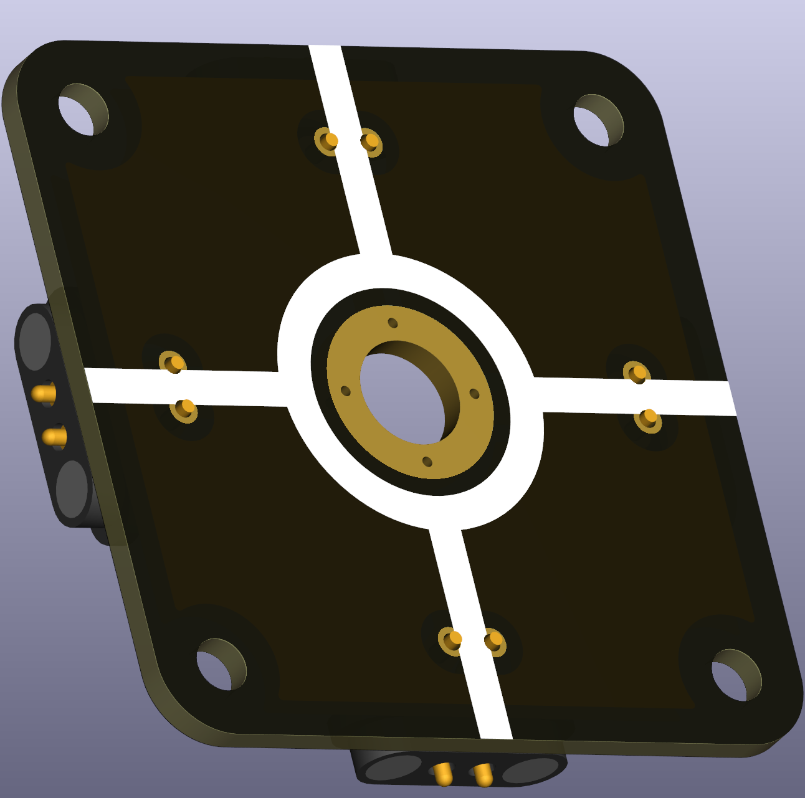
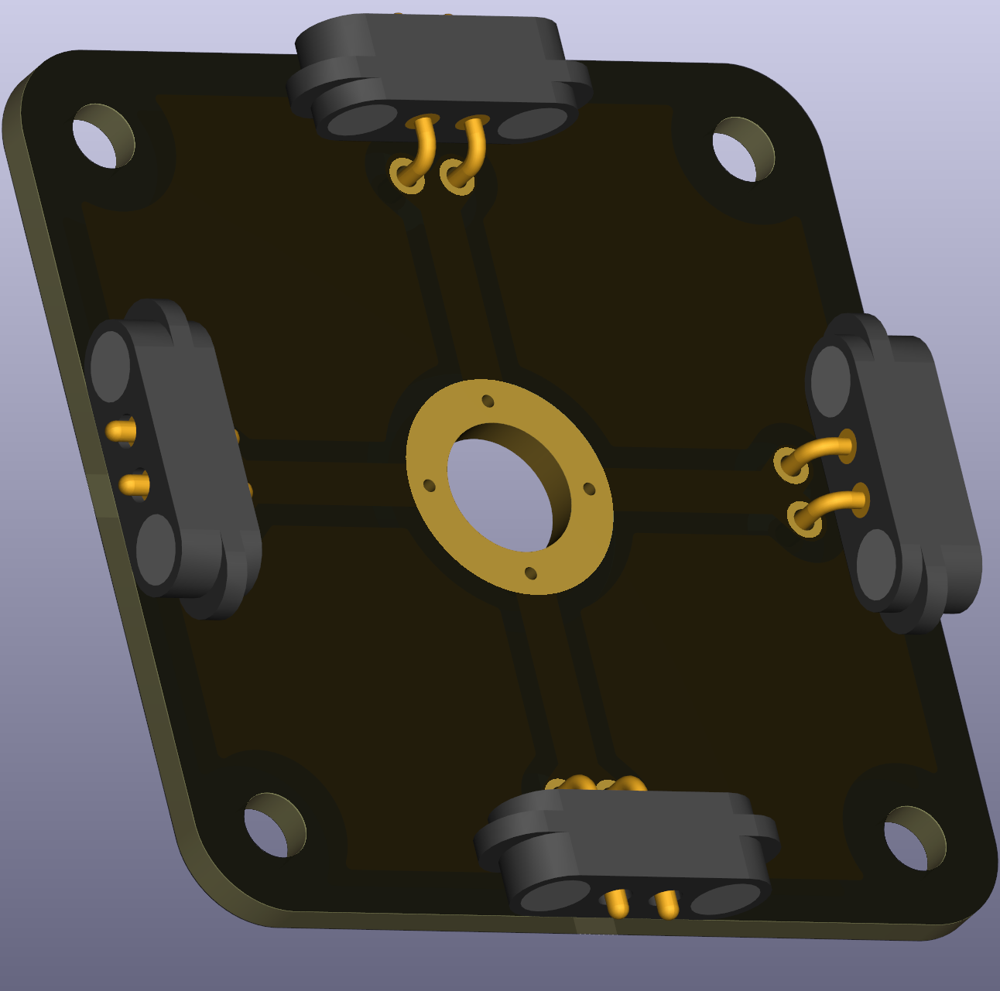

# Wire X-Crossing with Voltage Node

This puzzle piece is a wire junction that allows connections in four directions (two horizontal, two vertical) plus an M6-sized hole for a banana plug connector to measure voltage at that node. It's useful when you need to take a voltage measurement at a particular point in your circuit.

  