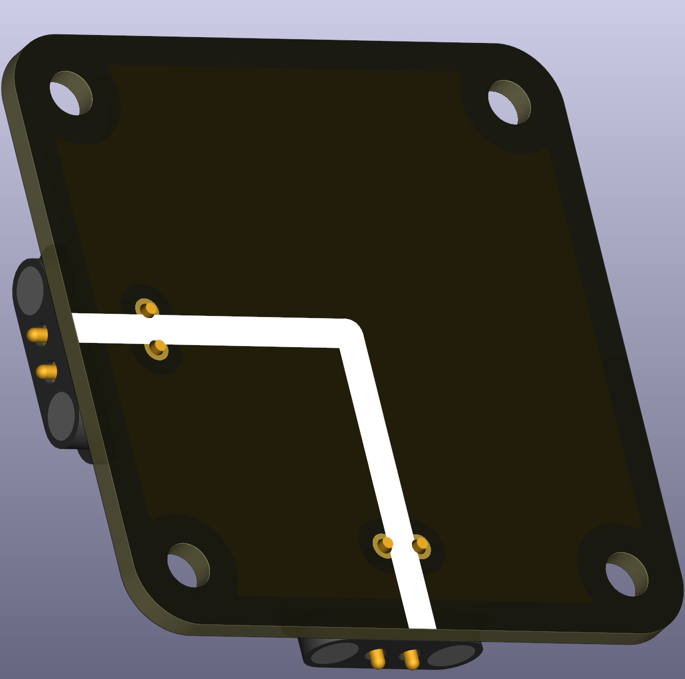
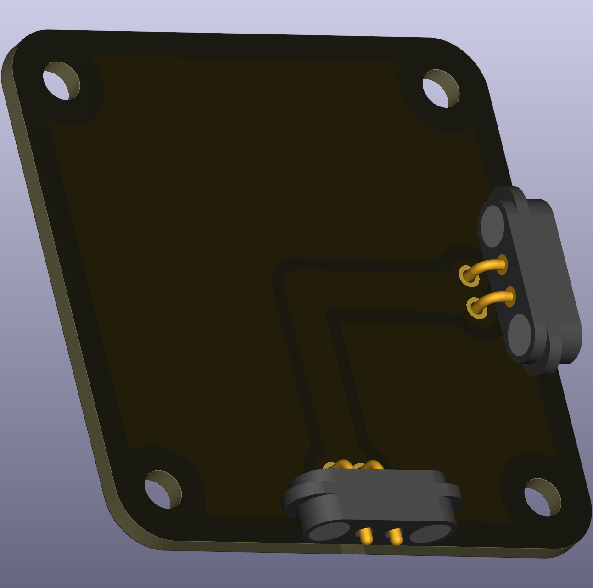

# Wire segment — angled (blank)

A simple angled wire segment with no measurement node. Use it to connect puzzle pieces where a corner in the wiring is needed.

 

## Typical uses in circuits
- Routing connections where a change of direction is required.

## Practical notes
- This part provides a straightforward visual and mechanical connection; it does not include measurement terminals.
