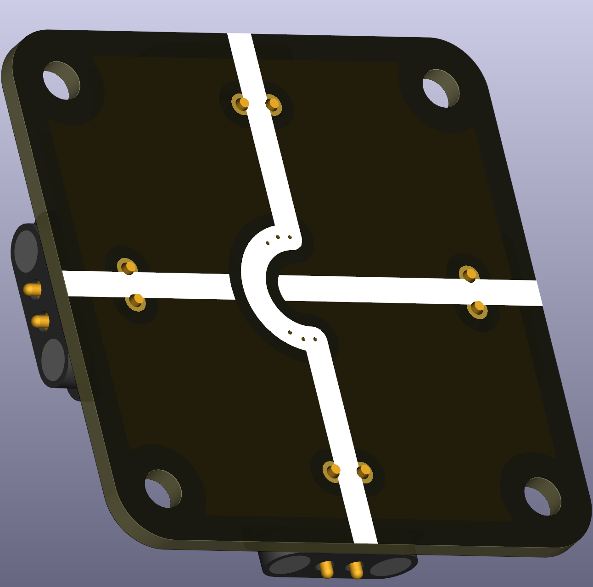
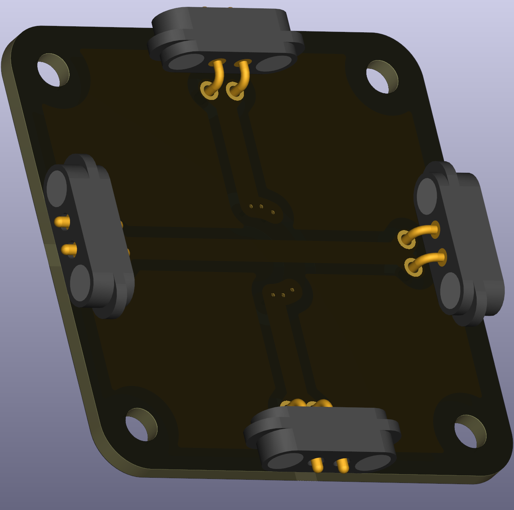

# Wire Bridge

This puzzle piece is a special wire segment that bridges across two perpendicular wire paths, connecting horizontal and vertical nodes without crossing diagonally. While most school circuits work fine in two dimensions, some advanced circuits—like full bridge rectifiers or complex multi-switch configurations—benefit from this three-dimensional routing capability. Although you could also build a bridge using two end nodes and a straight wire, having a dedicated bridge piece simplifies construction.

 