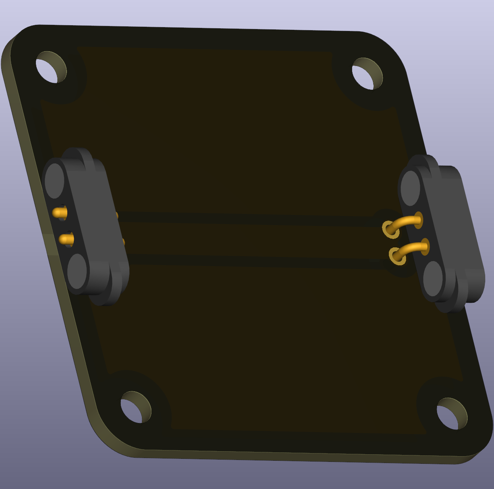

# Straight Wire

This puzzle piece is a basic straight wire segment that connects two nodes in a line. It's the fundamental building block for creating simple paths between components or other connector points in your circuit.

 
