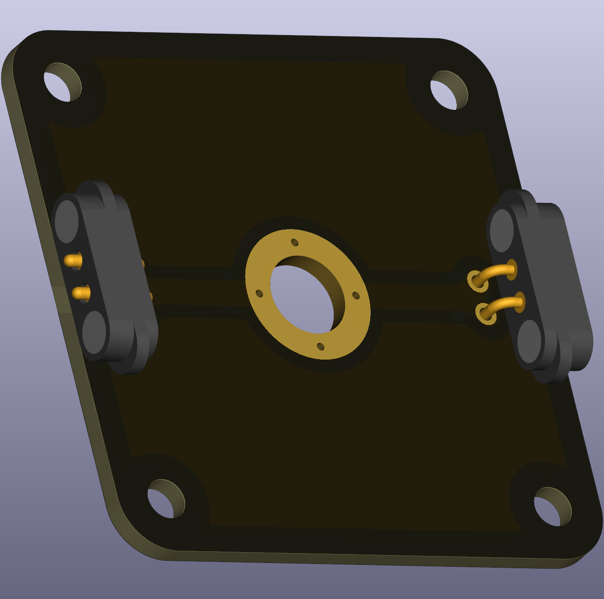

# Straight Wire with Voltage Node

This puzzle piece is a straight wire segment with an M6-sized hole for a banana plug connector, allowing you to measure voltage at any point along a wire run. It's the simplest way to tap into a circuit for voltage measurements without breaking the connection.

  