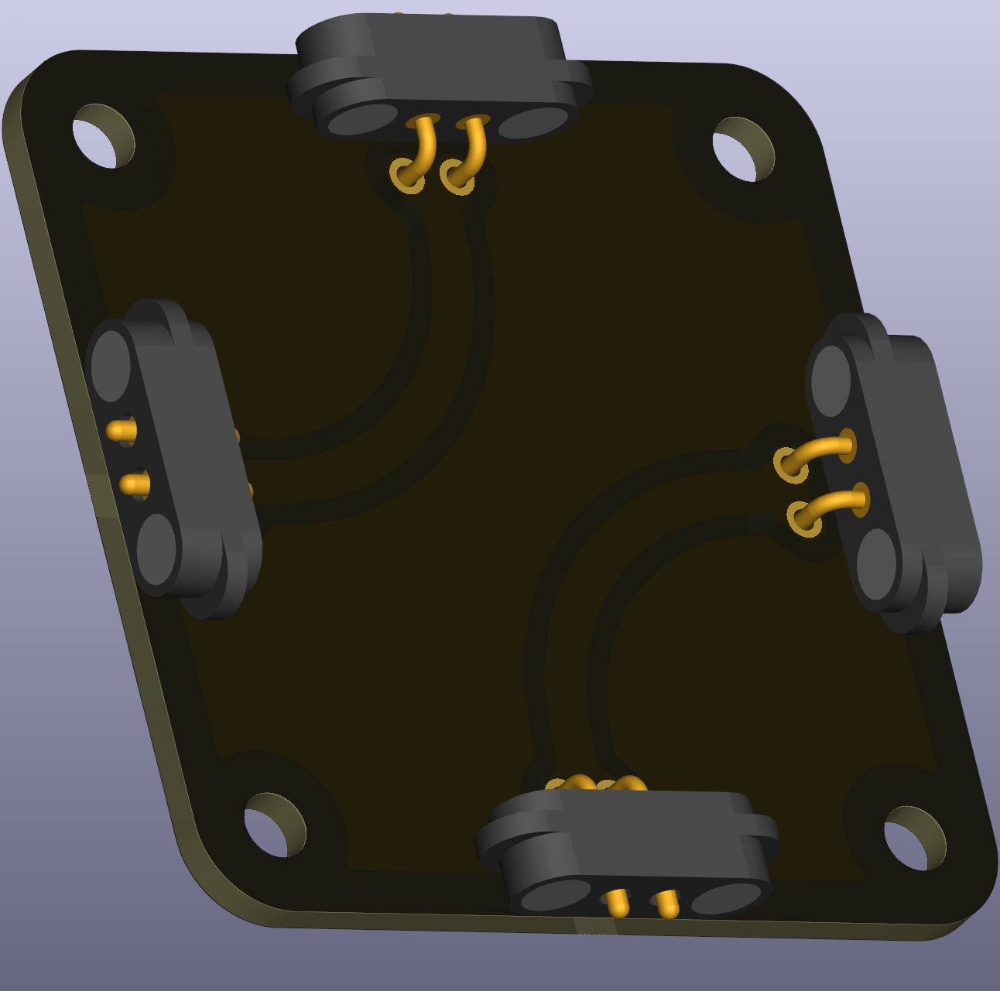

# Wire with Two Angles

This puzzle piece is a wire segment with two 90-degree bends, useful for compact circuits where you need to route connections around obstacles or in a minimal space. While not essential for most circuits, it can help reduce the overall footprint of your design when you're trying to build as compactly as possible.

 