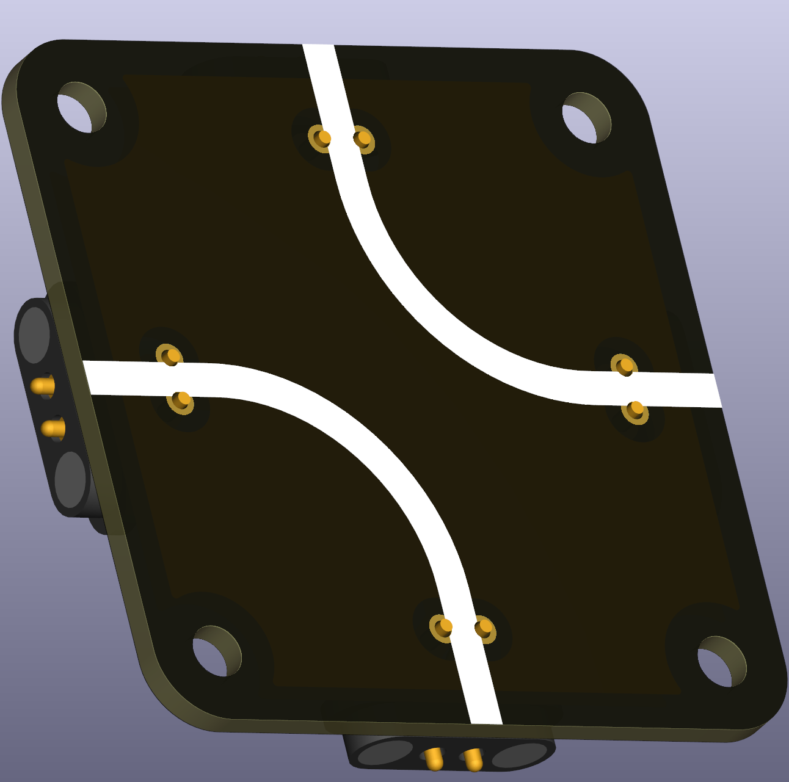

# Intro  
This is a simple wire segment as displayed without node for voltage measurement.

 

Note, this is a special segment only needed in special circuits when built as small as possible. This is more a gimmick than a realy needed part.